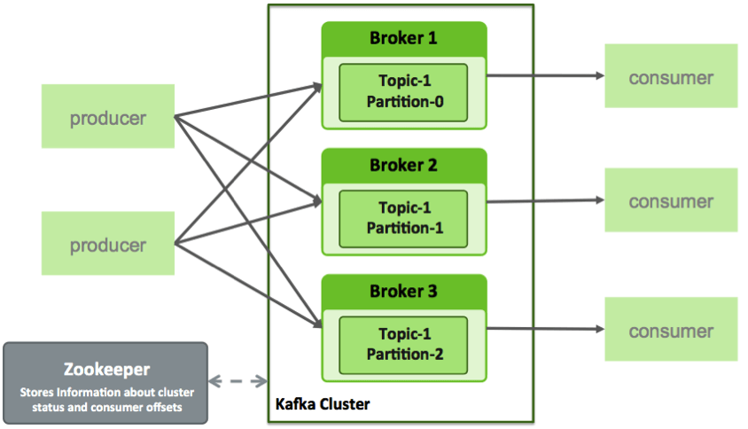

## Week 9 - Kafka

### Time 21/11 - 30/11

#### Messaging system

+ A messaging system is responsible for `transferring data` from one application to another, so the applications can focus on data, but not worry about how to share it.

+ Point to point messaging system
  + Messages are persisted in a `queue`. 
  + One or more consumers can consume the messages in the queue, but a particular message can be consumed by a maximum of `one consumer only.` 
  + Once a consumer reads a message in the queue, it `disappears` from that queue.

    

        
    

+ Publish-Subscribe messaging system
  + Messages are persisted in a topic.
  + Consumers can subscribe to one or more topic and consume all the messages in that topic.
  + Message producers are called `publishers` and message consumers are called `subscribers`.

    

        
    

#### Introduction to Kafka

+ Kafka is a `distributed streaming platform`. It is designed to send data from one server to another in a `fault-tolerant`, `high-capacity` way and, depending on the configuration, verify the receipt of sent data.

+ Kafka concepts
  + Producers - consume the data feed and send it to Kafka for distribution to consumers.
  + Consumers - applications that subscribe to topics.
  + Brokers - workers that take data from the producers and `send it` to the consumers. They handle replication as well.
  + Partitions - the `physical divisions` of a topic. They are used for redundancy as partitions are spread over different storage servers.
  + Topics - categories for messages.
  + Zookeeper - used to `start services` in distributed systems. So it is `not part of Kafka`, but is needed by Kafka.

    

        
    

+ Four feature of Kafka: `distributed`, `horizontally-scalable`, `fault-tolerant` and `commit log`.
  + Distributed
  + Horizontally-scalable
  + Fault-tolerant
  + Commit log: The log helps replicate data between nodes and acts as a re-syncing mechanism for `failed nodes` to restore their data. 

#### How does it work?

+ Applications (producers) send messages (records) to a Kafka node (broker) and said messages are processed by other applications called consumers. Said messages get stored in a topic and consumers subscribe to the topic to receive new messages.

    

        
    

+ As topics can get `quite big`, they get split into partitions of a smaller size for better performance and scalability. Kafka guarantees that all messages inside a partition are ordered in the sequence they came in. The way you distinct a specific message is through its offset, which you could look at as a normal array index, a sequence number which is incremented for each new message in a partition.

    

        
    

+ Kafka follows the principle of a `dumb broker` and `smart consumer`
  + Kafka `does not keep track of` what records are read by the consumer and delete them but rather stores them a set amount of time (e.g one day) or until some size threshold is met.
  + Consumers themselves `poll` Kafka for new messages and say what records they want to read.

+ Consumer groups which have `one or more` consumer processes inside. In order to avoid two processes reading the `same message twice`, each partition is `tied to only one consumer process` per group.

    

        
    
