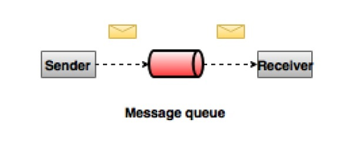
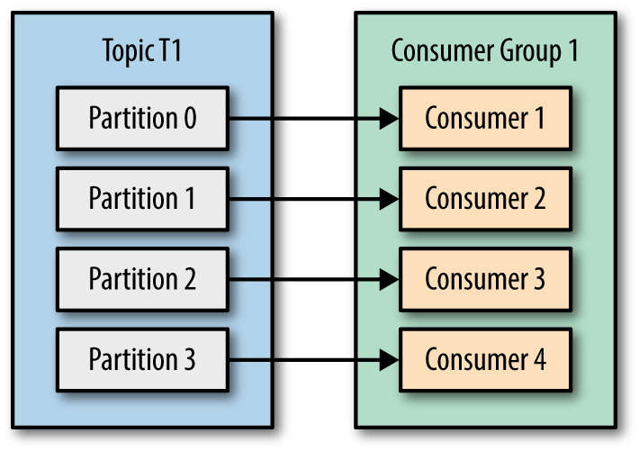
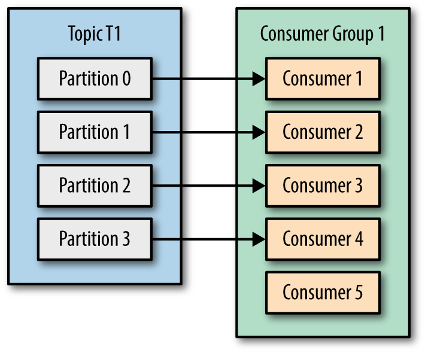

<h1> Week 9 - Kafka </h1>

<h2> Time 21/11 - 30/11 </h2>

<h3> Table of contents </h3>

- [Messaging system](#messaging-system)
- [Introduction to Kafka](#introduction-to-kafka)
- [Four features of Kafka](#four-features-of-kafka)
- [How does Kafka work?](#how-does-kafka-work)
- [Data Replication](#data-replication)
- [Kafka command](#kafka-command)

#### Messaging system

+ A messaging system is responsible for `transferring data` from one application to another, so the applications can `focus` on data, but not worry about `how` to share it.

+ Point to point messaging system
  + Messages are persisted in a `queue`. 
  + One or more consumers can consume the messages in the queue, but a particular message can be consumed by a maximum of `one consumer only.` 
  + Once a consumer reads a message in the queue, it `disappears` from that queue.

    <div align="center">
        
    </div>

+ Publish-Subscribe messaging system
  + Messages are persisted in a topic.
  + Consumers can subscribe to one or more topic and consume all the messages in that topic.
  + Message producers are called `publishers` and message consumers are called `subscribers`.

    <div align="center">
        
    </div>

#### Introduction to Kafka

+ Kafka is a `distributed streaming platform`. It is designed to send data from one server to another in a `fault-tolerant`, `high-capacity` way and, depending on the configuration, verify the receipt of sent data.

+ Kafka concepts
  + Producers - consume the data feed and send it to Kafka for distribution to consumers. The producer is responsible for `choosing which record` to assign to which `partition` within the topic. This can be done in a `round-robin` fashion simply to balance load
  + Consumers - applications that subscribe to topics.
  + Brokers - workers that take data from the producers and `send it` to the consumers. They handle replication as well.
  + Partitions - the `physical divisions` of a topic. They are used for redundancy as partitions are spread over different storage servers.
  + Topics - categories for messages.
  + Zookeeper - used to `start services` in distributed systems. So it is `not part of Kafka`, but is needed by Kafka.

    <div align="center">
        
    </div>

+ Producer will decide target partition to place any message, depending on
  + Partition id, if it's `specified` within the message
  + `key % num partitions`, if no partition id is mentioned
  + `Round robin` if neither partition id nor message key are available in message, meaning only value is available

+ Other key concepts
  + Cluster: collection of brokers
  + Controller: functionality within each broker, responsible for leader assignment and management
  + Replica: partition copy, represented by the broker-id
  + Assigned replicas: set of all replicas for a partition
  + ISR - In-Sync Replica: subset of assigned replicas that are in-sync with the leader

#### Four features of Kafka

+ Distributed: Kafka is distributed in the sense that it `stores`, `receives` and `sends` messages on `different nodes` (called brokers)

+ Horizontally-scalable
    <div align="center">
        
    </div>

+ Fault-tolerant: In a `5-node` Kafka cluster, you can have it continue working even if `2 of the nodes are down.`

+ Commit log: The log helps replicate data between nodes and acts as a re-syncing mechanism for `failed nodes` to restore their data. 

#### How does Kafka work?

+ Applications (producers) send messages (records) to a Kafka node (broker) and said messages are processed by other applications called consumers. Said messages get stored in a topic and consumers subscribe to the topic to receive new messages.

    <div align="center">
        
    </div>

+ As topics can get `quite big`, they get split into `partitions` of a smaller size for better performance and scalability. Kafka guarantees that all messages inside a partition are ordered in the sequence they came in. The way you distinct a specific message is through its offset, which you could look at as a normal array index, a sequence number which is incremented for each new message in a partition.

    <div align="center">
        
    </div>

+ Kafka follows the principle of a `dumb broker` and `smart consumer`
  + Kafka `does not keep track of` what records are read by the consumer and delete them but rather stores them a set amount of time (e.g one day) or until some size threshold is met.
  + Consumers themselves `poll` Kafka for new messages and say what records they want to read.

+ Consumer groups which have `one or more` consumer processes inside. In order to avoid two processes reading the `same message twice`, each partition is `tied to only one consumer process` per group. These are the `possible scenarios`

    + Number of consumers is `less than` number of topic partitions then multiple partitions can be assigned to one of the consumer in the group

        <div align="center">
            
        </div>

    + Number of consumers `same` as number of topic partitions, then partition and consumer mapping can be like below

        <div align="center">
            
        </div>

    + Number of consumers is `higher than` number of topic partitions, then partition and consumer mapping can be as seen below, Not effective, check Consumer 5

        <div align="center">
            
        </div>

#### Data Replication

+ Partition data is replicated across `multiple brokers` in order to preserve the data in case one `broker dies.`

+ One broker owns a partition and is the node through which applications `write/read` from the partition. This is called a partition `leader`. It replicates the data it receives to `N other brokers`, called `followers` - they store the data as well and are ready to be `elected` as leader in case the leader node dies.

    <div align="center">
        
    </div>

+ The information of all leaders partition for each broker are provided by Zookeeper

#### Kafka command

+ Start Zookeeper

    ```sh
        bin/zookeeper-server-start.sh config/zookeeper.properties
    ```

+ Start Kafka

    ```sh
        bin/kafka-server-start.sh config/name-of-server.properties
    ```

+ List all Kafka brokers

    ```sh
        bin/zookeeper-shell.sh localhost:2181 ls /brokers/ids
    ```

+ Work with topics

    ```sh
        # create a topic
        bin/kafka-topics.sh --create --bootstrap-server localhost:9092 --replication-factor 3 --partitions 3 --topic name-of-topic
    ```

    ```sh
        # list all topic
        bin/kafka-topics.sh --list --bootstrap-server localhost:9092
    ```

    ```sh
        # delete a topic
        bin/kafka-topics.sh --delete --bootstrap-server localhost:9094 --topic name-of-topic
    ```

    ```sh
        # show information of a topic
        bin/kafka-topics.sh --describe --zookeeper localhost:2181 --topic name-of-topic
    ```

+ Producer and consumer

    ```sh
        bin/kafka-console-producer.sh --broker-list localhost:9092 --topic name-of-topic
    ```

    ```sh
        bin/kafka-console-consumer.sh --bootstrap-server localhost:9092 --topic name-of-topic --from-beginning
    ```

    ```sh
        # show all consumer groups
        bin/kafka-consumer-groups.sh  --list --bootstrap-server localhost:9092

        # show information of a consumer group
        bin/kafka-consumer-groups.sh --describe --group consumerGroup10 --bootstrap-server localhost:9093
    ```