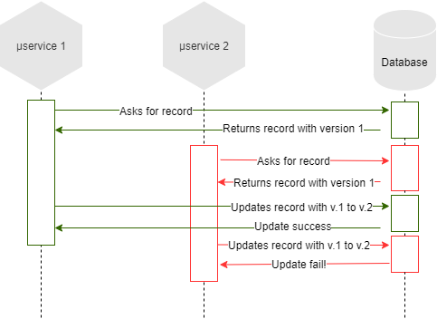
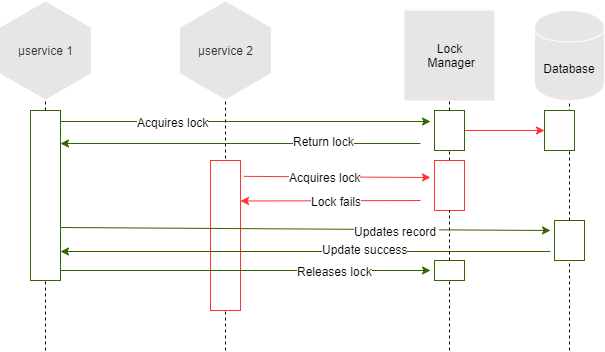

## Week 8 - Redis

### Time 11/11 -> 15/11

+ Cho service A cung cấp API ping, đồng thời có 1 counter để đếm số lần gọi của API này, mỗi lần api này đc gọi a tăng counter này lên, định kì mỗi 5 phút a cập nhật counter này xuống DB

+ Deploy service này với 2 instances, implement hàm ping sau cho phần counter luôn đếm đúng số lần gọi

#### Introduction to Redis

+ Redis is often introducted as a  `data structures server`. Redis is an open source, advanced key-value store and an apt solution for building high performance.

#### Redis data types

+ Redis key: Redis keys are `binary safe`, this means that you can use any binary sequence as a key, from a string like "foo" to the content of a JPEG file. `The empty string` is also a valid key.

+ Redis String: Redis string is a `sequence of bytes`. Strings in Redis are binary safe, meaning they have a known length not determined by any special terminating characters. Thus, you can store anything up to `512 megabytes` in one string.
  + The SET performs an assignment, `replace` any existing value stored into key.
  + A value can't be bigger than 512 MB.
  + `Atomic` INCR, DECR a value: increments/descrements it by one, and finally sets the obtained value as the `new value`.
  + Use `GETSET` command to set new value for a key and return old value of this key.
  + Use `MSET and MGET` for multi-set, get commands.

+ `Altering and querying` the key: use commands such as: DEL, EXISTS, TYPE

+ Redis `expires`: keys with `limited time to live`

+ Redis Lists
  + Redis lists are implemented via `Linked Lists` -> the operation of `adding` a new element in the `head or tail` of the list is performed in constant time. 
  + The downside of redis lists: `access time` not so fast.
  + Commands to interact with redis list: lpush/rpush - lrange - lpop/rpop - ltrim
  + Blocking operations on lists: use blpop/brpop - block if the list is `empty` - they'll return to the caller only when a `new element is added` to the list, or when a user-specified `timeout is reached`.

+ Redis Hashes
  + A Redis hash is a collection of key value pairs. Redis Hashes are maps between string fields and string values. Hence, they are used to represent objects.
  + The command `HMSET` sets multiple fields of the hash, while `HGET` retrieves a single field, `HMGET` is similar to HGET but returns an array of values and command `HGETALL` used for get all fields of hashes.

+ Redis Sets
  + Redis sets are unordered collections of strings. In Redis, you can add, remove, and test for the existence of members in `O(1) time complexity`.
  + Commands to interact with redis sets: sadd - smembers - sismember

+ Redis Sorted sets
  + Redis Sorted Sets are similar to Redis Sets, non-repeating collections of Strings. The difference is, every member of a Sorted Set is `associated with a score`, that is used in order to take the sorted set `ordered`, from the smallest to the greatest score. While members are unique, the `scores may be repeated`.
  + Commands to interact with redis sorted sets: zadd - zrange - z`rev`range, option `withscores` for zrange/zrevrange.
  + Operating on ranges: zrangebyscore

+ HyperLogLogs: 
  + HyperLogLog is a `probabilistic data structure` used in order to `count unique things`. The magic of this algorithm is that you no longer need to use an amount of memory proportional to the number of items counted, and instead can use a `constant amount` of memory (12k bytes in worth case)

#### Redis persistence

+ The RDB (Redis DataBase file): performs `point-at-time` snapshots of dataset at `specified intervals`.
  + RDB files are perfect for backups - disaster recovery
  + RDB allows faster restarts with big datasets
  + But,
  + RDB is NOT good if you need to `minimize the chance of data loss` in case Redis stops working.
  + RDB needs to `fork()` often in order to persist on disk using a child process.

+ The AOF (Append Only File): logs every time operation received by server.
  + Using AOF Redis is much `more durable`
  + he AOF log is an `append` only log, so there are `no seeks`
  + But,
  + AOP file usually bigger than RDB file
  + OF can be slower than RDB depending on the exact `fsync policy`

#### Introduction to distributed lock

+ We have two kinds of locks:
  + Optimistic: instead of blocking something potentially dangerous happens, we `continue anyway`, in the `hope` that everything will be ok.
    + To use optimistic lock, we usually use a `version field` on the database record we have to handle, and when we update it, we check if the data we read has the `same version` of the data we are writing.
        

            
        

  + Pessimistic: block access to the resource `before operating on it`, and we `release` the lock at the end.
    + The pessimistic lock, instead, will `rely on an external system` that will hold the lock for our microservices.
        

            
        

#### Distributed lock with Redis

+ In order to acquire the lock, the client performs the following operations:
  + It gets the `current time` in milliseconds
  + It tries to acquire the lock in all the N instances sequentially, using the same key name and random value in `all the instances`
  + The client computes how much time elapsed in order to acquire the lock, by subtracting from the current time the timestamp obtained in step 1
  + If the lock was acquired, its validity time is considered to be the initial validity time minus the time elapsed, as computed in step 3