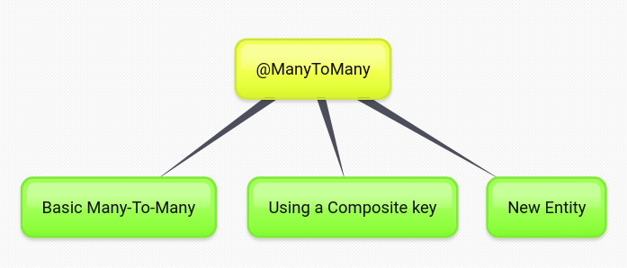

## Week 6 - JPA concept

### Time 28/10 - 01/11

+ Important concept: 
  + JPA: collection of `classes` and `methods` to persistently store data into database
  + JPA provider: framework implement of JPA concept such as Hibernate, EclipseLink,...

+ Concept inside JPA: Core classes and interfaces of JPA: `Persistence` (static method to create entity manager factory) -> `Entity Manager Factory` -> `Entity Manager` -> `Query`, `Entity class` (persistence object, records in the database), `Entity Transaction` (1-1 with entity manager)

+ Note entity manager: 
  > An EntityManager instance is associated with a persistence context. A persistence context is a set of entity instances in which for any persistent entity identity there is a unique entity instance. Within the persistence context, the entity instances and their lifecycle are managed. The EntityManager API is used to create and remove persistent entity instances, to find entities by their primary key, and to query over entities  - (docs oracle)

+ Purpose of entity manager: to perform create/read/update/delete (CRUD) operations on entities. Notice that first step to update or delete are find the entity, loading it into entity manager and then perform, final entity manager will be persist into db through commit.

+ Entity object life cycle: New - doing nothing, Managed - entity loaded - persist, Removed, Detached - entity object disconnected from the EntityManager

+ CRUD operations:
  + Create: add entity into context -> commit -> save to db
  + Retrieving: notice `persistence context` and retrival by way?
  + Update, delete flow: find and load entity -> execute 

+ An introduction to JPA: 
  + javax.persistence.Entity
  + Field persistence -> @Transient
  + Relationship: @OneToOne, @OneToMany, @ManyToOne, @ManyToMany
 
+ @OneToOne, @OneToMany: 
  + @JoinColumn(name = "foreign_key_in_db", referencedColumnName = "primary_key_in_db")
  + @OneToOne(mappedBy = ""), @OneToMany(mappedBy = "")
  + ManyToMany
    

      
    

+ Three phases of ORM - show how object data is stored into relational database
  

    
  

+ Two kind of entity manager: container-managed, non-managed.
  

    
  

+ JDBC vs JPA: 
  + JDBC is a standard for Database Access
  + JPA is a standard for ORM

+ Properties in annotation:
  + Fetch type:
  + Cascade type: