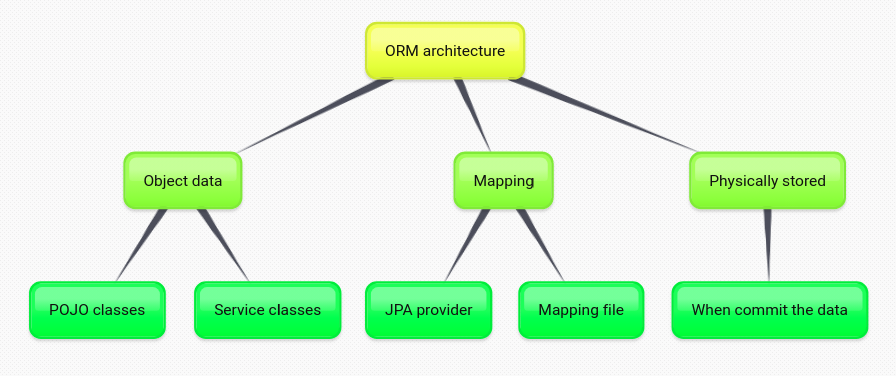
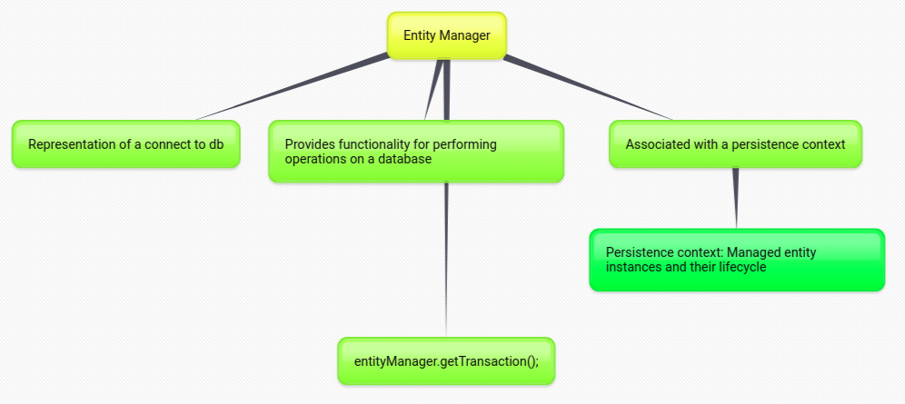

- JPA là gì?
- Core concepts của JPA e.g. EntityManager
- Phân biệt được JPA là gì và Hibernate là gì?
- Hibernate as JPA Provider nghĩa là thế nào

+ Important concept: 
  + JPA: collection of `classes` and `methods` to persistently store data into database
  + JPA provider: framework implement of JPA concept such as Hibernate, EclipseLink,...

+ Concept inside JPA: Core classes and interfaces of JPA: `Persistence` (static method to create entity manager factory) -> `Entity Manager Factory` -> `Entity Manager` -> `Query`, `Entity class` (persistence object, records in the database), `Entity Transaction` (1-1 with entity manager)

+ Three phases of ORM - show how object data is stored into relational database
  

    
  

+ Purpose of entity manager: to perform create/read/update/delete (CRUD) operations on entities. Notice that first step to update or delete are find the entity, loading it into entity manager and then perform, final entity manager will be persist into db through commit.

+ Two kind of entity manager: container-managed, non-managed.
  

    
  

