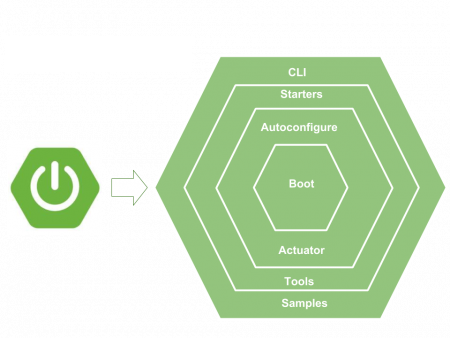

<h1> Week 2 - Spring Boot </h1>

<h2> Time 30/09 - 04/10 </h2>

#### Spring Boot module and detail of them

+ Spring Boot is a Spring framework module which provides RAD (`Rapid Application Development`) feature to the Spring framework. It is highly dependent on the `starter templates` feature which is very powerful and works flawlessly.

    <div align="center">
        
    </div>

+ Spring Boot starters are templates that contain a `collection of all the relevant transitive dependencies` that are needed to start a particular functionality.

#### Auto config in Spring Boot

+ Auto-configuration is enabled with `@EnableAutoConfiguration` annotation. Spring boot auto configuration scans the `classpath`, finds the libraries in the classpath and then attempt to guess the best configuration for them, and finally configure all such `beans`.

+ Auto-configuration tries to be as `intelligent` as possible and will back-away as you define more of your own configuration.

+ To run the application, we need to use `@SpringBootApplication` annotation. Behind the scenes, that’s equivalent to `@Configuration`, `@EnableAutoConfiguration`, and `@ComponentScan` together.

#### Externalized Configuration

+ Spring Boot allows you to `externalize` your configuration so you can work with the same application code in `different environments`. You can use properties files, YAML files, environment variables and command-line arguments to externalize configuration.

+ By convention, Spring Boot looks for an externalized configuration file – application.properties or application.yml – in 4 predetermined locations in the following order of precedence:
  + A /config subdirectory of the current directory
  + The current directory
  + A classpath /config package
  + The classpath root

#### Spring Profile

+ Spring Profiles provide a way to `segregate parts` of your application configuration and make it be available only in certain environments. Any `@Component, @Configuration or @ConfigurationProperties` can be marked with `@Profile` to `limit` when it is loaded.

    ```java
        @Configuration(proxyBeanMethods = false)
        @Profile("production")
        public class ProductionConfiguration {
            // ...
        }
    ```

+ Too adding active profiles
  + spring.profiles.active