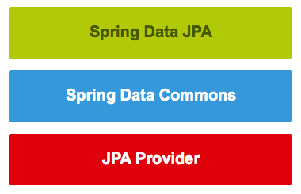
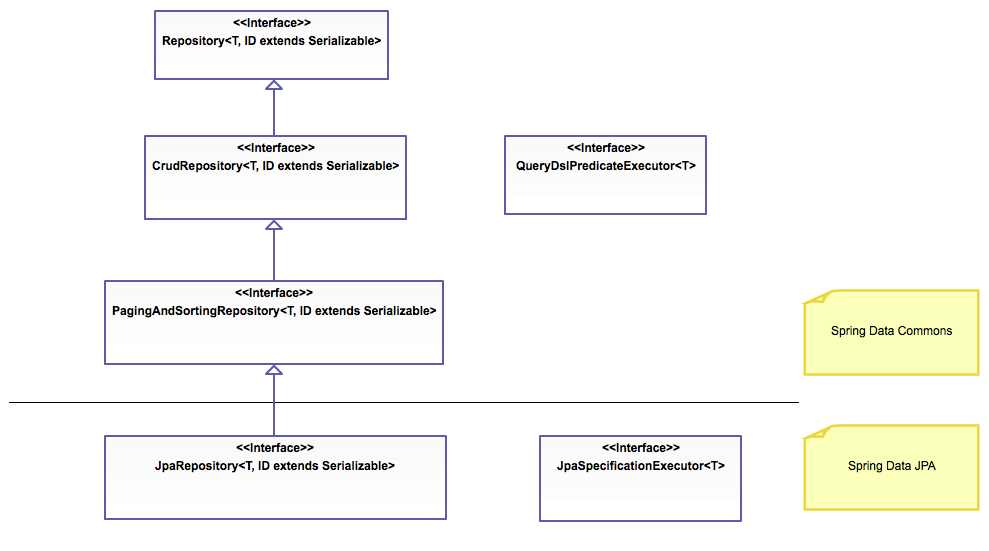
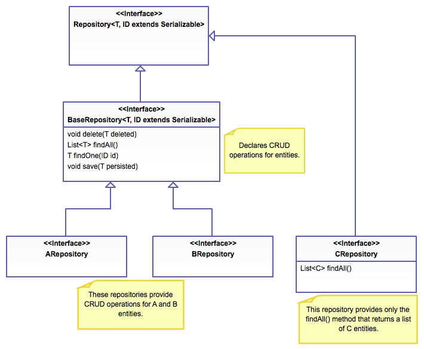
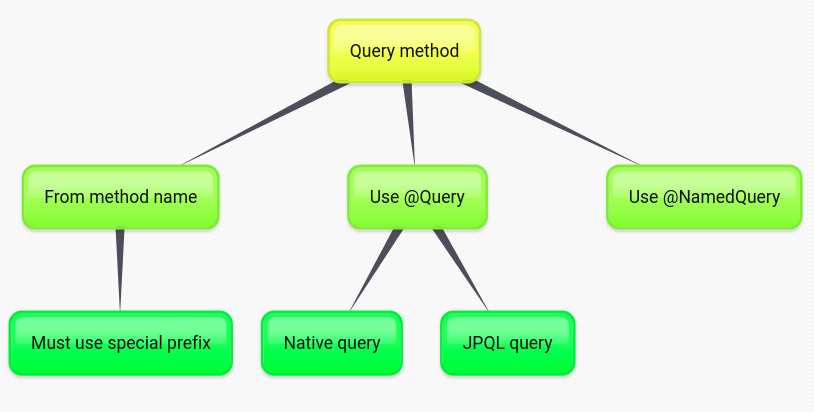

## Week 7 - Spring data JPA

### Time 4/11 -> 8/11

1. Spring Data JPA là gì?
2. Spring giúp mình những gì?
3. Cách sử dụng JPA Repository
4. Làm sao mình khai báo query bằng method name, mà Spring hiểu và query được?

#### Introduction

+ Spring Data JPA is `not` a JPA provider. It is a `library/framework` that adds an extra layer of abstraction on the top of our JPA provider (like Hibernate).

    > Implementing a data access layer of an application has been cumbersome for quite a while. Too much `boilerplate code` has to be written to execute simple queries as well as perform pagination, and auditing. Spring Data JPA aims to significantly improve the implementation of data access layers by reducing the effort to the amount that’s actually needed. As a developer you write your repository interfaces, including custom finder methods, and Spring will provide the implementation automatically.

+ If we decide to use Spring Data JPA, the `repository layer` of our application contains `three layers` that are described in the following:
  + `Spring Data JPA` provides support for creating JPA repositories by extending the Spring Data repository interfaces.
  + `Spring Data Commons` provides the infrastructure that is shared by the datastore specific Spring Data projects.
  + The `JPA Provider` implements the Java Persistence API.
  
  <div align="center">
    
  </div>

+ The repository hierarchy looks as follows:
  <div align="center">
    
  </div>

#### Defining repository interface

+ Use typical repository: First, define a domain class-specific repository interface and then extend `Repository` (or CrudRepository, JpaRepository)

+ Tuning repository definition (selectively exposing CRUD methods):
  + Create the `BaseRepository<T, ID>` interface that extends the Repository interface
  + Annotate the created interface with the `@NoRepositoryBean` annotation. This ensures that Spring Data JPA doesn't try to create an implementation for our base repository interface.
  + Add the common methods to the created interface.

    ```java
        @NoRepositoryBean
        interface BaseRepository<T, ID extends Serializable> extends Repository<T, ID> {
            void delete(T deleted);        
            List<T> findAll();
            Optional<T> findOne(ID id);
            T save(T persisted);
        }
    ```

    <div align="center">
        
    </div>

#### Query method

+ Query methods are methods that find information `from the database` and are `declared on the repository` interface.

    ```java
        import org.springframework.data.repository.Repository;
 
        interface TodoRepository extends Repository<Todo, Long> {
            //This is a query method.
            Todo findById(Long id);
        }
    ```

    <div align="center">
        
    </div>

+ Returning values from query method:
  + Basic type
  + Entity
  + Java 8 Optional<T>
  + List<T>
  + Stream<T>

+ Passing method parameters to query method:
  + Use based parameter bind
  + Named parameter

+ Query generation from the method name strategy: the invoked query is derived from the name of the query method.

+ We can create query methods that use this strategy by following `these rules`:
  + The `name of query method` must start with one of the following prefixes: find...By, read...By, query...By, count...By, and get...By.
  + To limit the number of returned query results: add First or Top keyword for exam findTopBy, findTop1By, findFirst1By,...
  + To select unique results: add Distinct keyword for exam findTitleDistinctBy or findDistinctTitleBy,...

+ Translate query method

+ Managing the Persistence Context: use @Qualifier

#### Query lookup strategies

+ Create

+ Use_Declared_Query

+ Create_If_Not_Found (defalut strantegy): combines use_declared_query and create.