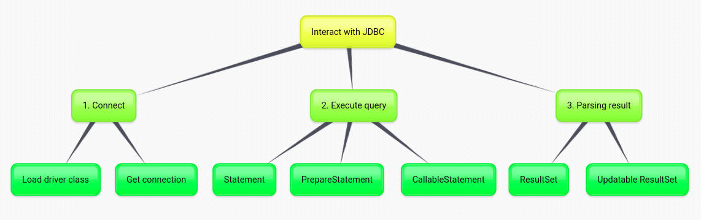
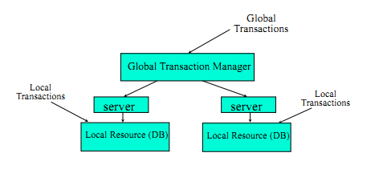
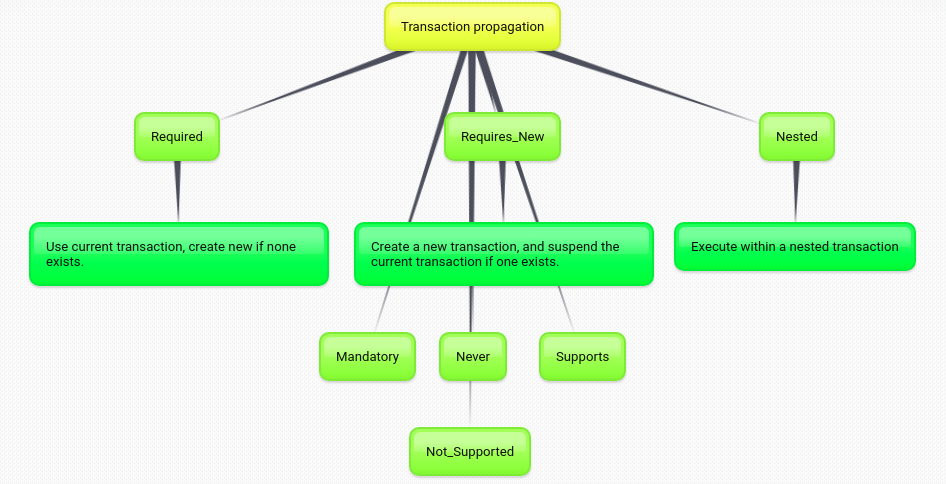
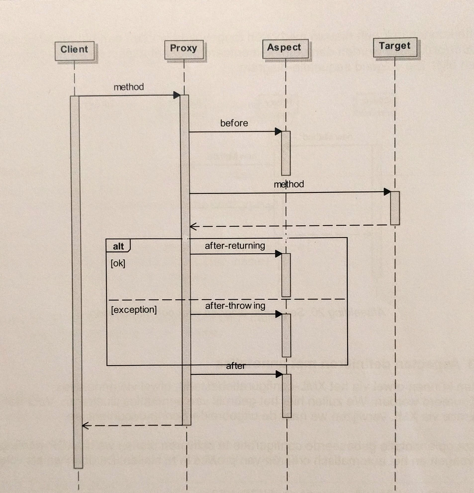
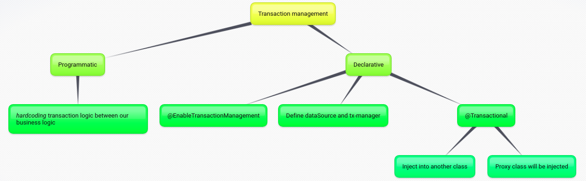

## Week 3 - Core JDBC

### Time 07/10 -> 11/10

### Concept of JDBC, JDBC driver and relates concept

+ JDBC -> JDBC drives (4 types)

    + JDBC -> ODBC -> DB
    + Native driver
    + JDBC -> middleware -> DB (network protocol driver)
    + JDBC -> DB (directly), 2 advantage and 1 disadvantage

+ Three types of statement

+ ResultSet

+ Flow when we interact with JDBC
  <div align="center">
    
  </div>

## Week 4 - Spring JDBC - Transaction and relates concept

### Time 14/10 -> 18/10 

+ Notice concept: jdbcTemplate, NamedParameterJdbcTemplate, RowMapper interface (create seperate class impl interface to map java bean and sql db) 
+ Spring boot dependency: 
  
  ```java
        <dependency>
          <groupId>org.springframework.boot</groupId>
          <artifactId>spring-boot-starter-jdbc</artifactId>
        </dependency>
  ```

+ Two type of transaction:
  + Local transactions are specific to a single transactional resource like a JDBC connection
  + Global transactions can span multiple transactional resources like transaction in a distributed system.
  <div align="center">
    
  </div>

+ PlatformTransactionManager - a service provider interface: This interface will define transaction strategy

+ TransactionDefinition:
  + Propagation:
        <div align="center">
            
        </div>
  + Isolation level
  + Timeout: the time between start transaction and end -> auto rollback
  + Read-only status 

+ Inside @Transactional
  + Transaction work flow
    <div align="center">
        
    </div>
  + Transaction management
    <div align="center">
        
    </div>

+ Concept of AOP in Spring
  + advice
  + pointcut
  + joinpoint

## Week 5

### Time 21/10 -> 25/10

+ Continue with transaction topic in Spring

+ Write test to verify