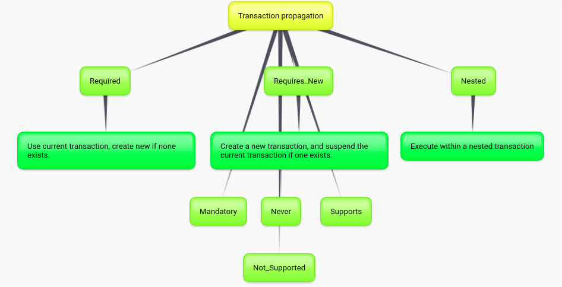
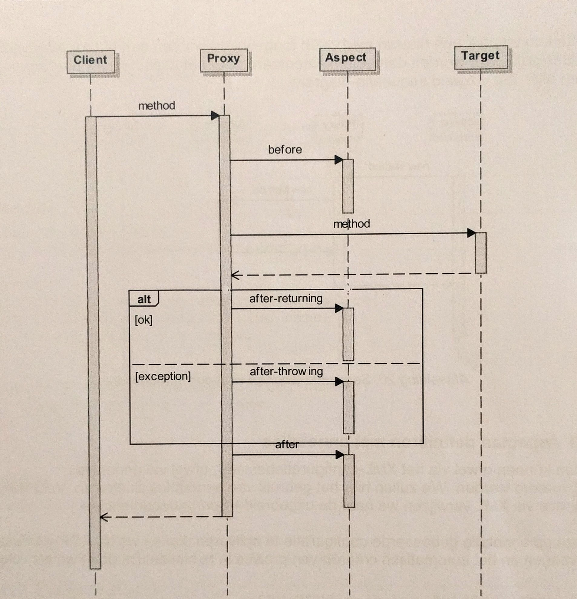
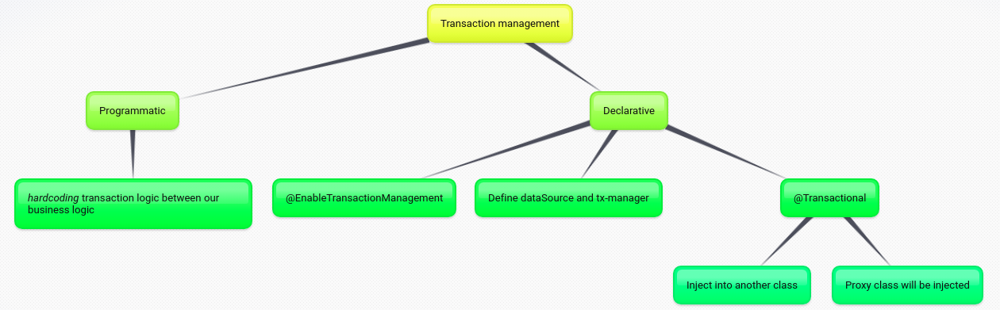

<h1> Week 4 + 5 - Spring JDBC - Transaction and relates concept </h1>

<h2> Time 14/10 - 25/10 </h2> 

+ Notice concept: jdbcTemplate, NamedParameterJdbcTemplate, RowMapper interface (create seperate class impl interface to map java bean and sql db) 
+ Spring boot dependency
  
  ```java
        <dependency>
          <groupId>org.springframework.boot</groupId>
          <artifactId>spring-boot-starter-jdbc</artifactId>
        </dependency>
  ```

+ Two type of transaction
  + Local transactions are specific to a single transactional resource like a JDBC connection
  + Global transactions can span multiple transactional resources like transaction in a distributed system.
  <div align="center">
    
  </div>

+ PlatformTransactionManager - a service provider interface: This interface will define transaction strategy

+ TransactionDefinition
  + Propagation:
        <div align="center">
            
        </div>
  + Isolation level
  + Timeout: the time between start transaction and end -> auto rollback
  + Read-only status 

+ Inside @Transactional
  + Transaction work flow
    <div align="center">
        
    </div>
  + Transaction management
    <div align="center">
        
    </div>

#### Concept of AOP in Spring

+ AOP is a programming paradigm that aims to increase `modularity` by allowing the `separation` of cross-cutting concerns. 

    <div align="center">
        
    </div>

+ A Joinpoint is a `point` during the execution of a program, such as `execution` of a method or the handling of an exception.

+ A Pointcut is a predicate that `helps` match an Advice to be applied by an Aspect at a particular JoinPoint.

+ An advice is `an action` taken by an aspect at a particular Joinpoint. Different types of advice include `around`, `before` and `after` advice.
